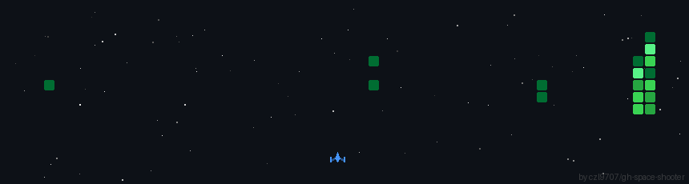

<div align="center">


<br>


<br><br>


</div>

---

## About Me

```bash
$ whoami

Ahmad Widad
Infrastructure Engineer
Backend Developer
Linux Enthusiast
```

I'm an **Infrastructure Engineer and Backend Developer** interested in Linux systems, networking, virtualization, backend development, automation, and DevOps.

Currently working at **LifeMedia**, working with infrastructure, servers, networking, deployment, and system operations.

---

## Infrastructure & DevOps

<p align="center">


</p>

<p align="center">


</p>

---

## Backend Development

<p align="center">


</p>

<p align="center">


</p>

---

## Networking

<p align="center">


</p>

```text
Routing              VLAN
Firewall             VPN
Network Security     FTTH
Virtualization       Linux Networking
Infrastructure       Server Deployment
Monitoring           Automation
```

---

## Featured Projects

### Cowrie Honeypot

SSH honeypot environment for observing malicious SSH activity, brute-force attempts, attacker behavior, and security logs using **Cowrie / T-Pot**.

### Infrastructure Lab

Infrastructure projects involving:

```text
Linux Server
Proxmox VE
Virtual Machines
MikroTik Networking
Firewall & Routing
VPN
Docker
Monitoring
Automation
```

---

## GitHub Statistics

<div align="center">


</div>

<br>

<div align="center">



</div>

---

## GitHub Activity

<div align="center">


</div>

---

## Technologies

<div align="center">


</div>

---

## Currently Learning

<div align="center">


</div>

---

## Current Focus

```text
Infrastructure    Linux & Virtualization
Networking        Routing & Security
Backend           APIs & Applications
Automation        Deployment & Tooling
DevOps            CI/CD & Containers
```

---

## Connect

<div align="center">

<a href="https://github.com/ahmadwidad">


</a>

</div>

<br>

<div align="center">

<br>


</div>
